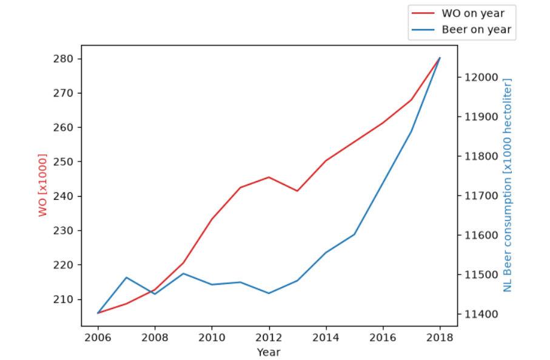

V16753542
Fantastic yeasts and where to find them: the hidden diversity of dimorphic fungal pathogens
An analysis of the forces required to drag sheep over various surfaces
Improving Recommendation Lists Through
Topic Diversification

We can see that there is a positive correlation between both variables, between the years of 2010 and 2016 there is the biggest gap between the two variables. 
Although, both variables are increasing they are not increasing at the same rates. However, correlation does not indicate causation. It may seem trivial to make the 
direct link that more WO students causes more beer to be consumed however they both could be symptomatic of many other factors like economic development,
increased population density, or the cheaper relative cost of beer or an increase in student organisations.
